# PID Speed Control of a Separately Excited DC Motor using Simulink

> A Simulink implementation of a PID-controlled Separately Excited DC Motor (SEDCM) for speed regulation under varying load conditions.

---

## Overview

This project presents the modelling, simulation, and speed control of a **Separately Excited DC Motor (SEDCM)** using **MATLAB Simulink**. The motor is first modeled from its electrical and mechanical equations, from which the transfer function is analytically derived. A **PID controller** is then incorporated into the closed-loop system to improve speed regulation and maintain stable performance under varying load disturbances.

Unlike purely theoretical implementations, this project develops the complete motor model using **Simulink blocks**, allowing the motor dynamics to be represented directly from the governing differential equations. The controller parameters are obtained through a combination of analytical derivation and MATLAB's PID Tuner before being implemented in the Simulink model.

The project compares the behaviour of the motor in both **open-loop** and **closed-loop** configurations and demonstrates the improvements achieved through PID control.

---

# Features

* Mathematical modelling of a Separately Excited DC Motor
* Transfer function derivation from first principles
* Open-loop motor simulation
* Closed-loop PID-controlled motor simulation
* Complete implementation using Simulink blocks
* Variable load disturbance analysis
* Comparison of open-loop and closed-loop performance
* Time-domain performance evaluation

---

# Project Objectives

* Model the dynamics of a Separately Excited DC Motor.
* Derive the motor transfer function from the governing equations.
* Develop the motor model entirely using Simulink blocks.
* Design and implement a PID controller for speed regulation.
* Evaluate motor performance under varying load conditions.
* Compare open-loop and closed-loop system behaviour.
* Analyze controller performance using standard control system metrics.

---

# System Modelling

The motor model is derived from the fundamental electrical and mechanical equations governing a separately excited DC motor.

The following relationships are used during modelling:

### Electrical Dynamics

* Field Voltage Equation
* Armature Voltage Equation
* Back Electromotive Force (Back EMF)

### Mechanical Dynamics

* Torque Balance Equation
* Rotor Speed Equation
* Motor Torque Equation

These equations are transformed into the Laplace domain to obtain the motor transfer function, which forms the basis for the controller design.

---

# Controller Design

The controller design follows two stages.

## 1. Analytical Design

The PID controller is first incorporated into the derived motor transfer function.

Using classical control theory, the closed-loop transfer function is obtained from the motor model, establishing the relationship between:

* Proportional Gain (Kp)
* Integral Gain (Ki)
* Derivative Gain (Kd)

The PID control law is represented by

[
u(t)=K_pe(t)+K_i\int e(t)dt+K_d\frac{de(t)}{dt}
]

The resulting closed-loop transfer function is then used as the basis for controller tuning.

---

## 2. PID Tuning

The derived transfer function is imported into MATLAB's **PID Tuner**, where the controller gains are optimized for:

* Fast response
* System robustness
* Minimal overshoot
* Reduced settling time
* Accurate reference tracking

The optimized controller gains are then implemented in the Simulink closed-loop model.

### Optimized PID Parameters

| Parameter |  Value |
| --------- | -----: |
| Kp        | 131.24 |
| Ki        | 633.63 |
| Kd        |   0.71 |

---

# Motor Parameters

| Parameter                |       Value |
| ------------------------ | ----------: |
| Armature Resistance (Ra) |         2 Ω |
| Armature Inductance (La) |     16.2 mH |
| Field Resistance (Rf)    |       180 Ω |
| Field Inductance (Lf)    |     71.47 H |
| Rotor Inertia (Jm)       | 0.117 kg·m² |
| Viscous Friction (Bm)    | 0.001 N·m·s |
| Armature Voltage         |       220 V |
| Field Voltage            |       300 V |
| Load Torque              |    0–80 N·m |

---

# Simulink Implementation

The complete simulation is implemented using **Simulink blocks**.

The Simulink models represent:

* Field current dynamics
* Armature current dynamics
* Motor torque generation
* Motor speed dynamics
* Open-loop transfer function
* Closed-loop transfer function
* PID controller
* Variable load disturbances

---

# Results

The simulations evaluate the following motor characteristics:

* Motor Speed
* Armature Current
* Field Current
* Motor Torque
* Open-loop Step Response
* Closed-loop Step Response
* Disturbance Rejection

---

# Performance Metrics

| Metric        |    Value |
| ------------- | -------: |
| Rise Time     | 0.0061 s |
| Settling Time | 0.0238 s |
| Overshoot     |   4.62 % |

---

# Open-Loop vs Closed-Loop Comparison

| Characteristic        | Open Loop | PID Controlled |
| --------------------- | --------- | -------------- |
| Speed Regulation      | Poor      | Excellent      |
| Reference Tracking    | No        | Yes            |
| Disturbance Rejection | Poor      | Excellent      |
| Overshoot             | High      | Low            |
| Settling Time         | Slow      | Fast           |
| Stability             | Moderate  | High           |

---

# Results

### Open-Loop Model

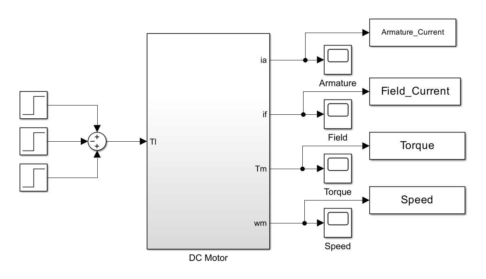

---

### PID Controller

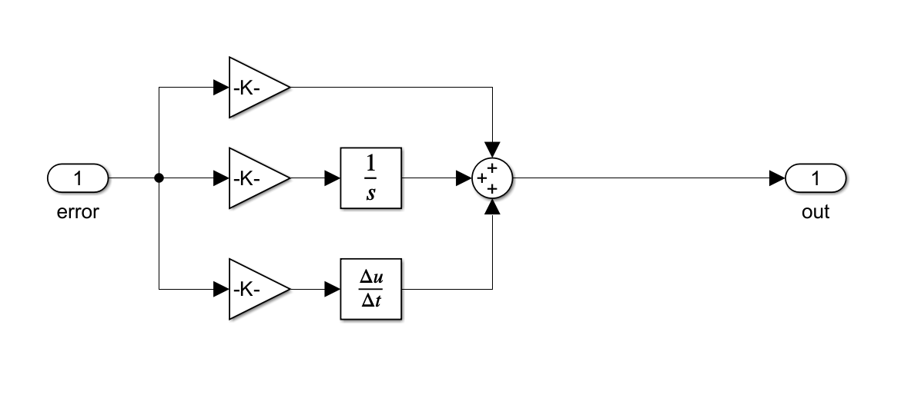

---

### Closed-Loop PID Model

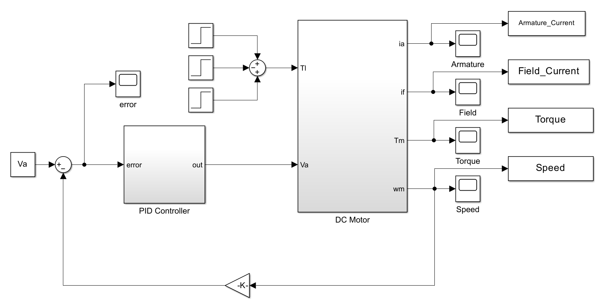

---

### Motor Speed

<table>
  <tr>
    <td>
      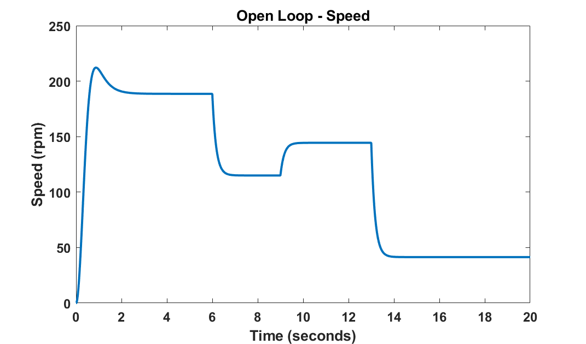
    </td>
    <td>
      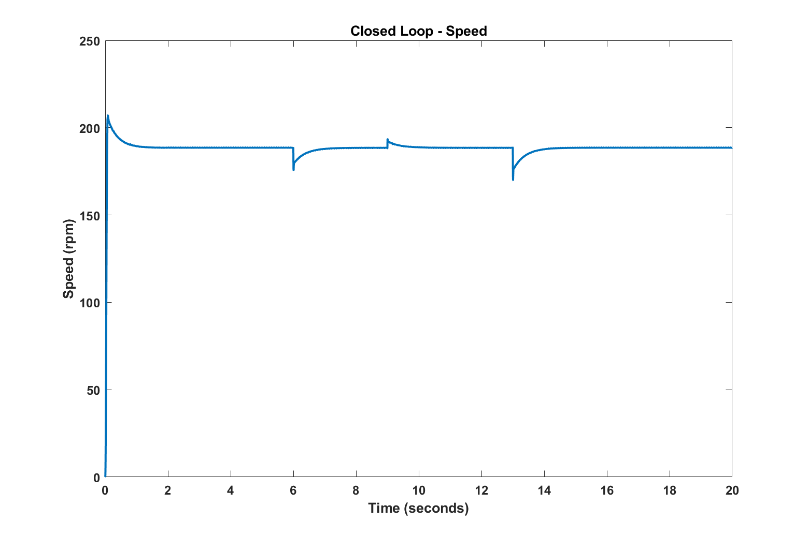
    </td>
  </tr>
</table>

---

### Armature Current

<table>
  <tr>
    <td>
      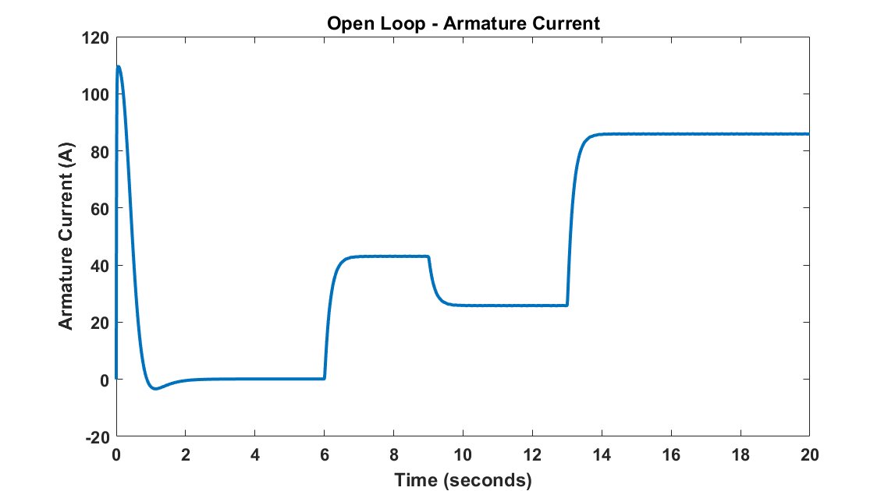
    </td>
    <td>
      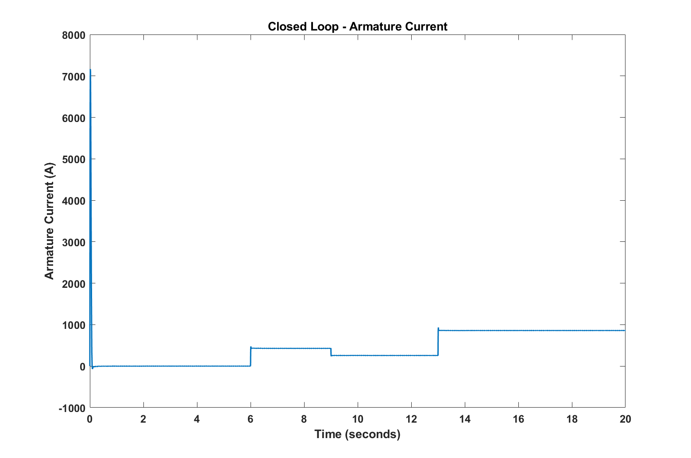
    </td>
  </tr>
</table>

---

### Field Current

<table>
  <tr>
    <td>
      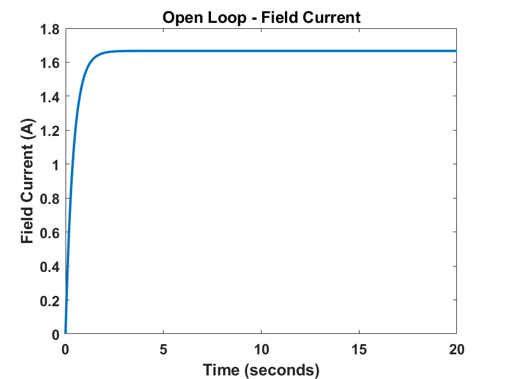
    </td>
    <td>
      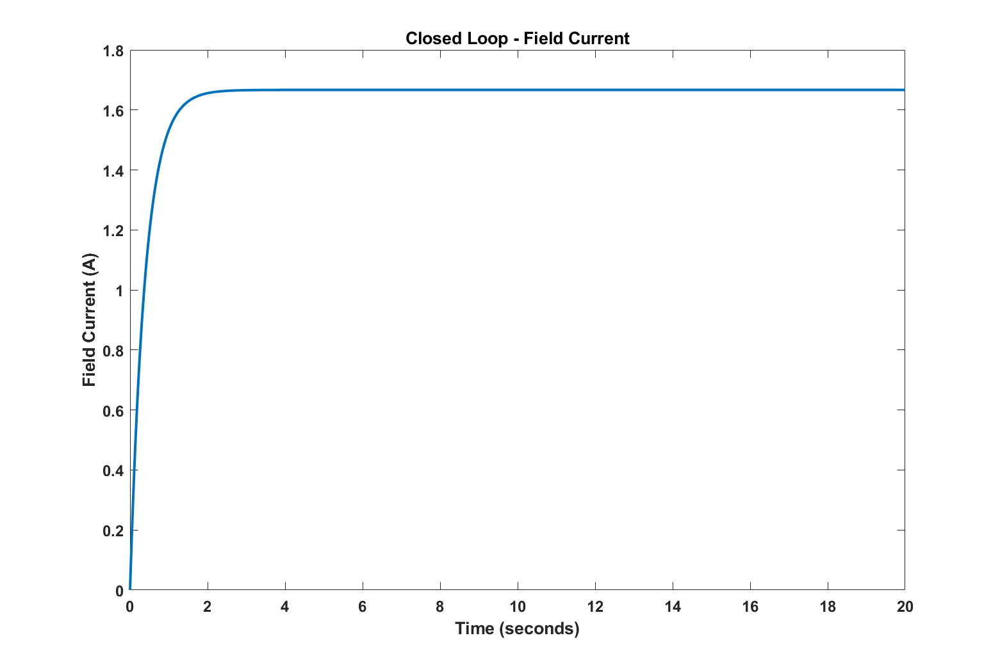
    </td>
  </tr>
</table>

---

### Torque

<table>
  <tr>
    <td>
      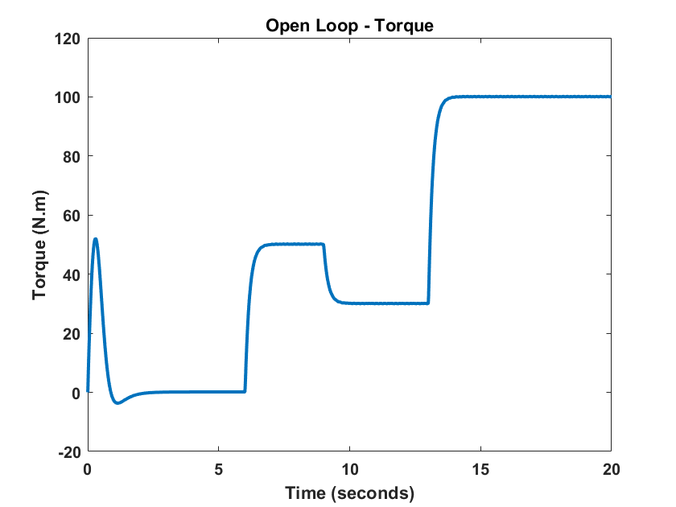
    </td>
    <td>
      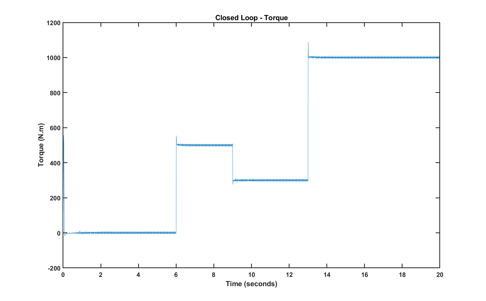
    </td>
  </tr>
</table>

---

# Key Findings

* The PID controller significantly improves speed regulation compared to the open-loop system.
* The controller maintains accurate reference tracking under varying load conditions.
* Armature current increases proportionally with load torque.
* Field current remains nearly constant due to separate field excitation.
* The controller effectively compensates for external disturbances, enabling the motor to quickly return to its desired operating speed.
* The closed-loop system exhibits a fast response with low overshoot and short settling time.

---

# Software Requirements

* MATLAB
* Simulink
